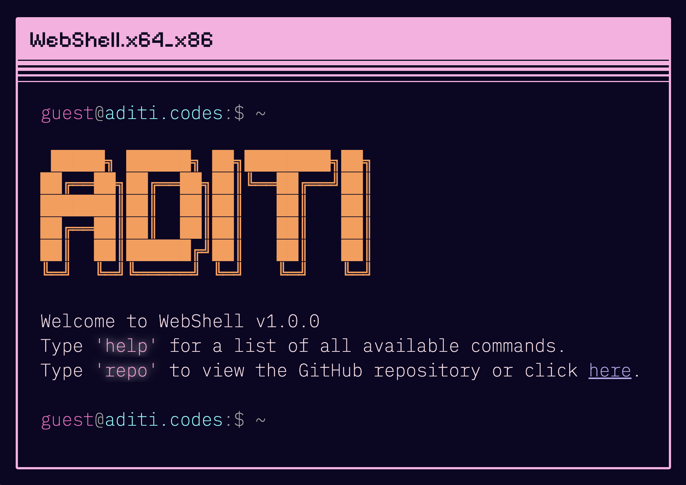

# [WebShell | Terminal Portfolio Website](https://webshell.aditi.codes/)

> Forked from [https://github.com/nasan016/webshell](https://github.com/nasan016/webshell)




## Features
* **[Tab]** for auto completion.
* **[Esc]** to clear the input line.
* **[↑][↓]** to scroll through your command history.

## ???
<div align="center">
  
</div>
How did we get here?

## Configuration

Most of the configuration is done in the `config.json` file.

> Generate ascii [here](https://patorjk.com/software/taag/). ANSI Shadow is the current font family.

```json
{
  "ascii": [
    " █████╗ ██████╗ ██╗████████╗██╗",
    "██╔══██╗██╔══██╗██║╚══██╔══╝██║",
    "███████║██║  ██║██║   ██║   ██║",
    "██╔══██║██║  ██║██║   ██║   ██║",
    "██║  ██║██████╔╝██║   ██║   ██║",
    "╚═╝  ╚═╝╚═════╝ ╚═╝   ╚═╝   ╚═╝"
  ],
  "title": "WebShell",
  "repoLink": "https://github.com/aditi-dsi/webshell",
  "social": {
    "x": "https://x.com/halfacupoftea_",
    "linkedin": "https://linkedin.com/in/aditi-bindal",
    "github": "https://github.com/aditi-dsi",
    "devto":"https://dev.to/aditi_b",
    "email": "aditii.b6@email.com"
  },
  "aboutGreeting": "Hi, I am Aditi Bindal, a developer/devrel speciailizing in web3 and ai.",
  "projects": [
    [
      "AISuite",
      "AI powered content management suite, currently on waitlist, built with Next.js, Supabase.",
      "https://aisuite.shwetlabs.com"
    ],
    [
      "Shwet",
      "Truth Chain for sharing owned text/media with zk-proof, underhood rust smart contracts for solana. ",
      "https://github.com/yashsangwan00/Shwet"
    ]
  ]
}
```

## Run the Project Locally:

Clone the repository
```shell
git clone https://github.com/aditi-dsi/webshell.git
```
Go to the project directory
```shell
cd webshell
```
Install the dependencies
```shell
npm install
```
Start the server
```shell
npm run dev
```
